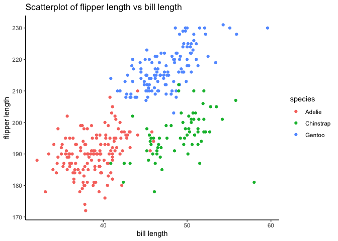

p8105_hw1_jl6521
================
Jiayi
2024-09-18

## Problem 1: dataset description

The penguins dataset contains the 3 species of penguins(“species”), name
of island (“island”) such as Biscoe, Dream, and Torgersen, and their
various features, such as their length and depth of bill
(“bill_length_mm”)(“bill_depth_mm”), their flipper length
(“flipper_length_mm”), their body mass (“body_mass_g”), their sex
(“sex”), and their age (“year”). All the detailed information are listed
below in the summary table. The dataset has 344 rows and 8 columns, and
the mean flipper length is 200.9152.

``` r
data("penguins", package = "palmerpenguins")
summary(penguins)
```

    ##       species          island    bill_length_mm  bill_depth_mm  
    ##  Adelie   :152   Biscoe   :168   Min.   :32.10   Min.   :13.10  
    ##  Chinstrap: 68   Dream    :124   1st Qu.:39.23   1st Qu.:15.60  
    ##  Gentoo   :124   Torgersen: 52   Median :44.45   Median :17.30  
    ##                                  Mean   :43.92   Mean   :17.15  
    ##                                  3rd Qu.:48.50   3rd Qu.:18.70  
    ##                                  Max.   :59.60   Max.   :21.50  
    ##                                  NA's   :2       NA's   :2      
    ##  flipper_length_mm  body_mass_g       sex           year     
    ##  Min.   :172.0     Min.   :2700   female:165   Min.   :2007  
    ##  1st Qu.:190.0     1st Qu.:3550   male  :168   1st Qu.:2007  
    ##  Median :197.0     Median :4050   NA's  : 11   Median :2008  
    ##  Mean   :200.9     Mean   :4202                Mean   :2008  
    ##  3rd Qu.:213.0     3rd Qu.:4750                3rd Qu.:2009  
    ##  Max.   :231.0     Max.   :6300                Max.   :2009  
    ##  NA's   :2         NA's   :2

``` r
nrows = nrow(penguins)
ncols = ncol(penguins)
flipper_length = pull(penguins,flipper_length_mm)
mean_flipper = mean(flipper_length,na.rm = TRUE)
print(paste("The mean flipper length is", mean_flipper))
```

    ## [1] "The mean flipper length is 200.915204678363"

``` r
ggplot(penguins,aes(x = bill_length_mm, y = flipper_length_mm, color = species)) +
  geom_point() + 
  xlab("bill length") + 
  ylab("flipper length") + 
  ggtitle("Scatterplot of flipper length vs bill length") + 
  theme_classic()
```

    ## Warning: Removed 2 rows containing missing values or values outside the scale range
    ## (`geom_point()`).

<!-- -->

``` r
ggsave("Scatterplot_flipper_bill_length.jpg", height = 4, width = 6)
```

    ## Warning: Removed 2 rows containing missing values or values outside the scale range
    ## (`geom_point()`).
